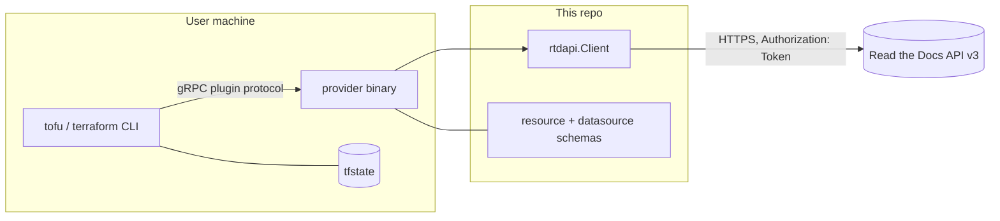

# PROJ-ARCH — terraform-provider-readthedocs

## Overview

A from-scratch **Terraform/OpenTofu provider** for the hosted **Read the Docs REST API v3**, written in
Go on `terraform-plugin-framework`. It lets portfolio docs infrastructure (e.g. the `github-utils`
project) be declared in HCL: projects, versions, builds (push trigger), sync-versions, redirects,
environment variables, subprojects, and Business-tier sharing can be created/read/updated, plus 18
read-only data sources.

It is deliberately **not** a fork of `BarnabyShearer/readthedocs` (abandoned 2022, projects only) or of
any MCP — client and schemas are written from the official v3 API docs. Distribution is house-style: a
local build installed into the shared plugin mirror at `~/.local/share/terraform/plugins` (same pattern
as SigNoz / `noizu/foryou` providers); GitHub `v*` releases via goreleaser exist for checksum/signing
but there is no registry listing.

## System Diagram

## Core Components

| Component | Purpose |
|-----------|---------|
| `main.go` | Entry point — serves the provider over the plugin handshake |
| `internal/provider/provider.go` | Provider config (`token`, `base_url`), builds shared `rtdapi.Client`, registers 8 resources + 18 data sources |
| `internal/provider/res_project.go` | `readthedocs_project` (the only full CRUD-ish resource) |
| `internal/provider/res_rest.go` | `version`, `build`, `sync_versions` resources |
| `internal/provider/res_more.go` | `redirect`, `environment_variable`, `subproject`, `sharing` resources |
| `internal/provider/ds.go` | All data sources via one **generic datasource** (`genericDS` + shared `listModel`) parameterized by name/read-fn |
| `internal/provider/helpers.go` | Shared JSON→state mapping helpers |
| `internal/rtdapi/client.go` | From-scratch REST client: auth header, endpoint builders, RTD JSON shapes (+ unit tests) |

## Data Flow

`Configure` resolves token (provider block > `READTHEDOCS_TOKEN`) and base URL
(provider block > `READTHEDOCS_BASE_URL` > `.org` default) and stores one `*rtdapi.Client` in provider
context. Every resource/datasource operation is then a stateless REST call: plan/apply diffs local
schema state vs remote GET; writes map to the narrow verbs RTD v3 allows (notably: **no project
DELETE**, env-vars have no PATCH, version changes are only activate/hide via PATCH). Every resource
keeps a `json` attribute with the raw API object as an escape hatch; list data sources return
`result_count` + `results_json`.

## Infrastructure / Delivery

- **Local install (house path)**: `scripts/build-provider.sh` → `go build` into
  `~/.local/share/terraform/plugins` for both `registry.opentofu.org` and `registry.terraform.io`
  mirror layouts; `~/.terraformrc` `dev_overrides` skips `init` downloads.
- **CI**: `.github/workflows/ci.yml` (build+test on push/PR); `release.yml` runs goreleaser on `v*`
  tags (multi-arch, checksums, GPG-signed with `gpg-pubkey.asc`).
- **No servers, queues, or DB** — the provider is a short-lived child process of the CLI.

## Key Decisions

- **From-scratch client** instead of forking the abandoned community provider: full v3 coverage
  (orgs, remote VCS, embed, sharing) with schemas we control.
- **Generic datasource pattern**: 18 read-only sources share one model/read plumbing, cutting
  boilerplate; per-source behavior is a name + read function + optional extra attributes.
- **`json` passthrough attributes**: RTD API evolves faster than the provider; raw JSON preserves
  access to undocumented fields.
- **Local mirror over registry**: no HashiCorp Registry listing needed; consistent with the house
  SigNoz/foryou provider installs.
- **API-limit honesty**: resources intentionally omit operations the public API does not offer
  (documented in README rather than faked).

## Notes

- Sensitive values (`token`, env-var values, sharing passwords) live in plaintext tfstate — see
  [PROJ-SCHEMA.md](PROJ-SCHEMA.md) § State Interaction.
