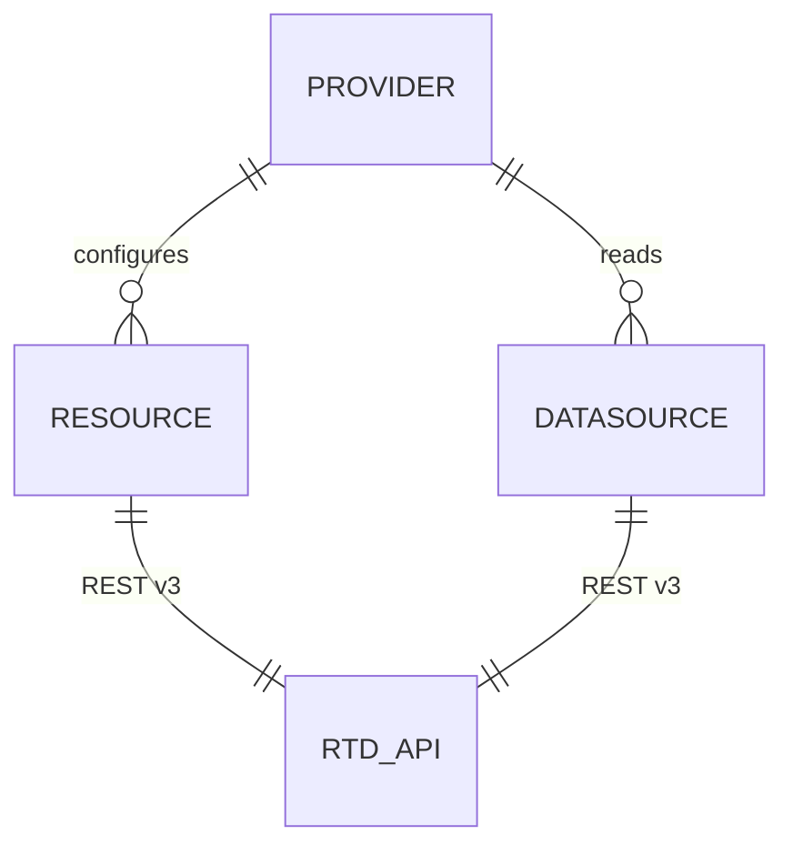

# PROJ-SCHEMA.summary — terraform-provider-readthedocs

**No persistence layer** — no DB/SQL schema. Provider for hosted Read the Docs API v3; state lives
remotely at RTD + in Terraform tfstate.

- Provider config: `token` (sensitive, env `READTHEDOCS_TOKEN`), `base_url` (env `READTHEDOCS_BASE_URL`)
- 8 resources: `project`, `version`, `build`, `sync_versions`, `redirect`, `environment_variable` (sensitive value), `subproject`, `sharing` (Business, sensitive password)
- 18 data sources, one shared generic model; list sources return `result_count` + `results_json`
- Notable: project has no DELETE (API limit); env-var resource has no PATCH
- Sensitive values persist in plaintext tfstate — keep state out of git

