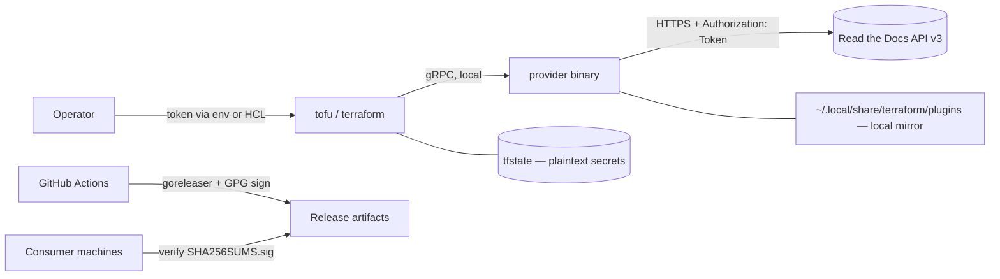

# THREAT-MODEL — terraform-provider-readthedocs

## Overview

This project is a **local CLI plugin, not a service**: no ingress, no listeners, no persistence of its
own. The process is spawned by `terraform`/`tofu`, reads one credential from config/env, and makes
outbound HTTPS calls to the Read the Docs API v3. The crown jewels are therefore (1) the **RTD API
token** — full control of every project under the account — and (2) **Terraform state**, which carries
that token's effects (environment-variable values, sharing passwords) in **plaintext**.

Trust boundaries that matter:

1. **User machine ↔ RTD API** — the only network crossing; token in flight over TLS.
2. **Provider process ↔ local filesystem** — tfstate + plugin-mirror binaries on disk.
3. **CI/release pipeline ↔ consumers** — binaries + checksums are GPG-signed; consumers verify with
   `gpg-pubkey.asc`.

Grounding: components and data flow per [PROJ-ARCH.md](PROJ-ARCH.md); file locations per
[PROJ-LAYOUT.md](PROJ-LAYOUT.md); state attribute sensitivity per [PROJ-SCHEMA.md](PROJ-SCHEMA.md).

## Attack Surface

No HTTP routes, webhooks, queues, or databases exist. Surface is: env/config input, outbound REST,
local files, and the release pipeline.

## Vulnerability Register

| ID | Severity | STRIDE | Component | Status |
|----|----------|--------|-----------|--------|
| T-001 | High | Info disclosure | `examples/github-utils/terraform.tfstate*` contain real resource state incl. env-var values | Mitigated — `*.tfstate*` in `.gitignore`; treat as transient, never commit |
| T-002 | Medium | Info disclosure | Sensitive attrs (`environment_variable.value`, `sharing.password`, sharing `token`) persist **plaintext in tfstate** | Partial — marked `Sensitive` (redacted in plan/apply output); plaintext in state file is inherent to Terraform; state file protection is operator's responsibility |
| T-003 | Medium | Info disclosure | Provider `token` supplied via env `READTHEDOCS_TOKEN` (visible to child processes / `ps` on some platforms) | Accepted — standard Terraform provider pattern; monorepo sources it from Infisical-managed `.envrc.dc`, never committed |
| T-004 | Medium | Tampering / supply chain | CI + release use third-party actions pinned **by tag, not SHA** (`actions/checkout@v4`, `setup-go@v5`, `crazy-max/ghaction-import-gpg@v6`, `goreleaser-action@v6`) | Open — tag-pinned only; a compromised tag could tamper release artifacts before signing |
| T-005 | Low | Info disclosure | Error strings embed up to 500 bytes of raw API response (`rtdapi/client.go`) — may echo secret-adjacent fields into CLI logs | Accepted — bounded at 500 chars; RTD error bodies are not known to echo token material |
| T-006 | Low | Spoofing | No certificate pinning; trust relies on system CA store (`http.Client` default) | Accepted — standard for CLI tooling; a compromised CA/MITM could capture the token |
| T-007 | Low | DoS | Client pagination caps at 10,000 results; no retry/backoff — 429s from RTD (60 req/min) surface as hard errors | Accepted — rate limits are documented; worst case is a failed plan/apply, not corruption |
| T-008 | Low | Repudiation | No audit logging in provider (RTD-side audit is the real record) | Accepted — RTD logs API actions under the token's account |

## Mitigation Coverage

1 mitigated · 1 partial · 2 open/accepted-pending · 4 accepted.

- T-001 mitigated by `.gitignore` (`*.tfstate*`, `dist/`, `.terraform/`).
- T-002 partially mitigated by `Sensitive: true` schema flags (`internal/provider/res_more.go`);
  full fix would require state encryption (Terraform-side feature, not provider code).
- T-004 open: SHA-pinning the four workflow actions is a one-line-each fix worth taking.
- Release integrity (covers consumers of `v*` artifacts): SHA256SUMS + GPG detach-sign
  (`.goreleaser.yml` `signs:`) with public key published in-repo (`gpg-pubkey.asc`).

## Residual Risk

Plaintext secrets in tfstate (T-002) and tag-pinned CI actions (T-004) are the two items a real
attack would most plausibly ride; both are bounded — T-002 by the example being a throwaway project,
T-004 by artifacts being signed with a key GitHub Actions only holds as an encrypted secret
(`GPG_PRIVATE_KEY`/`PASSPHRASE`). No network daemon exists to attack; the provider's blast radius is
the RTD account itself.
